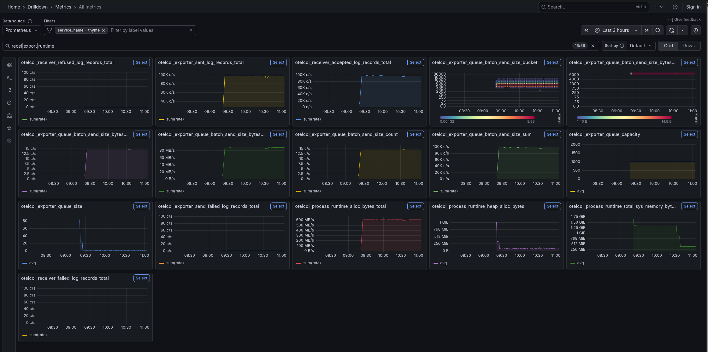

# ⏱️ Thyme

Thyme is a Tulip-based OpenTelemetry Collector distribution optimized for high-throughput log processing. Built for performance benchmarking and validation of log collection at scale.

## Overview

Thyme is a specialized distribution based on [Tulip](https://github.com/ollygarden/tulip), OllyGarden's commercially supported OpenTelemetry Collector distribution. While Tulip provides a general-purpose, production-ready collector, Thyme focuses specifically on:

- **High-throughput log ingestion** - Optimized for processing 50-100k+ log records per second
- **Performance benchmarking** - Tuned configurations for measuring collector performance
- **Edge collection** - DaemonSet deployments reading from Kubernetes log files

## Use Case

Thyme was created to validate OpenTelemetry Collector performance for enterprise log collection scenarios where:

- Logs are collected from `/var/log/pods` on Kubernetes nodes
- Kubernetes metadata enrichment is required
- Throughput requirements exceed 50k log records/second per node
- Resource consumption must remain bounded on shared nodes

## Distribution Components

Thyme includes components optimized for log collection:

**Receivers:**
- `filelog` - File-based log receiver for Kubernetes pod logs
- `otlp` - OTLP Receiver for forwarding

**Processors:**
- `k8sattributes` - Kubernetes metadata enrichment
- `batch` - Batching for efficient export
- `memory_limiter` - Resource consumption bounds

**Exporters:**
- `otlp` - OTLP Exporter using gRPC protocol
- `otlphttp` - OTLP Exporter using HTTP protocol
- `debug` - Debug exporter for testing

**Extensions:**
- `healthcheck` - Health Check Extension
- `pprof` - Profiling for performance analysis

## Performance Targets

| Metric | Target |
|--------|--------|
| Log throughput | 100k records/sec (default config) |
| Average log size | ~500 bytes (100-1000 byte range) |
| Deployment mode | DaemonSet |
| Node type | m6i.2xlarge (8 vCPU, 32GB RAM) |

### Benchmark Results

The following dashboard shows collector metrics during a 100k logs/sec benchmark run:



Key metrics shown:
- **otelcol_exporter_sent_log_records_total** - Logs successfully exported
- **otelcol_receiver_accepted_log_records_total** - Logs received by collectors
- **otelcol_exporter_queue_batch_send_size** - Batch sizes being sent
- **otelcol_process_runtime_heap_alloc_bytes** - Memory usage
- **otelcol_process_cpu_seconds_total** - CPU consumption

## Getting Started

### Prerequisites

- Go 1.22 or later
- OpenTelemetry Collector Builder (ocb) - automatically downloaded by the Makefile
- (Optional) Docker & Docker Compose for containerized testing

### Build Commands

Build the Thyme distribution:

```bash
make build
```

This generates the binary at `distributions/thyme/build/thyme`.

Run locally with the test configuration:

```bash
make run
```

Clean build artifacts:

```bash
make clean
```

### Container Image

Build the Docker image:

```bash
make docker-build
```

Build and push to GitHub Container Registry:

```bash
make docker-push
```

Build and load into k3d cluster:

```bash
make k3d-load

# Or specify a cluster name
K3D_CLUSTER=my-cluster make k3d-load
```

## Configuration

Thyme includes two configuration files:

- **`config.yaml`**: Production configuration with filelog receiver and k8sattributes processor for Kubernetes DaemonSet deployments
- **`config-local.yaml`**: Local testing configuration with OTLP receiver only

## Deployment

Thyme can be deployed in three ways:

### Docker Compose (Local Development)

See [deployment/compose/](deployment/compose/) for local testing with Docker Compose.

```bash
cd deployment/compose
docker-compose up
```

### Kubernetes (k3d - Local Benchmarking)

See [deployment/kubernetes/](deployment/kubernetes/) for Kubernetes manifests.

```bash
kubectl apply -k deployment/kubernetes/
```

### AWS EKS (Production Benchmarking)

See [infrastructure/aws/](infrastructure/aws/) for OpenTofu/Terraform infrastructure-as-code and [deployment/aws/](deployment/aws/) for AWS-specific Kubernetes overlays.

```bash
# Provision infrastructure
cd infrastructure/aws
tofu init && tofu apply

# Configure kubectl
aws eks update-kubeconfig --region eu-central-1 --name thyme-benchmark

# Deploy stack
kubectl apply -k deployment/aws/
```

**Cost**: ~$2.50/hour (~$60/day) for 3× m6i.2xlarge nodes in eu-central-1. See [infrastructure/aws/README.md](infrastructure/aws/README.md) for details.

### Architecture

The setup creates a realistic two-stage collection pipeline for performance testing:

```
loggen (10,000 lines/sec × 10 pods = 100k/sec)
    ↓ (writes to stdout → containerd)
/var/log/pods/*
    ↓ (filelog receiver)
thyme collector (DaemonSet)
    ↓ (k8sattributes → batch → OTLP exporter)
nop-collector
    ↓ (nop exporter - discards data)
   ∅

Both collectors send internal telemetry → LGTM
```

**Components:**
- **loggen**: Generates 10,000 log lines/sec per pod (100-1000 byte lines) to stdout, captured by containerd
- **thyme**: Reads logs via filelog receiver, processes (batch, memory_limiter, resource), exports via OTLP to nop-collector
- **nop-collector**: Receives OTLP, processes, exports to nop (discard)
- **LGTM**: Collects internal telemetry (metrics, traces) from both collectors on port 3000

**Exposed Ports:**
- `3000` - Grafana (LGTM)
- `8080` - loggen metrics
- `55679` - nop-collector zpages
- `55680` - thyme zpages
- `1777` - nop-collector pprof
- `1778` - thyme pprof

Access Grafana via port-forward (`kubectl port-forward -n lgtm service/grafana 3000:3000`) at **http://localhost:3000** to observe collector internal telemetry (throughput, latency, resource usage). For k3d local development, NodePort is also available at **http://localhost:30000**.

## Performance Testing

### Automated Benchmarking

#### Local (k3d)

Run a complete automated benchmark with report generation:

```bash
# Run 60-minute benchmark (default)
./scripts/run-benchmark.sh

# Run custom duration (in minutes)
./scripts/run-benchmark.sh 10

# Or use Claude Code skill
# In Claude Code: "Run a benchmark"
```

This will:
1. Create k3d cluster with 2 agents
2. Build and deploy Thyme + LGTM stack
3. Monitor performance for specified duration
4. Collect metrics and logs
5. Generate report in `./local/reports/YYYY-MM-DD-NN/`

See [scripts/README.md](scripts/README.md) for details.

#### AWS EKS

Run production-scale benchmarks on AWS EKS with automated infrastructure provisioning:

```bash
# Run benchmark with default 30-minute active phase + ramp-up/cool-down
./scripts/run-benchmark-aws.sh

# Custom active duration (60 minutes)
./scripts/run-benchmark-aws.sh 60

# Custom cluster name
./scripts/run-benchmark-aws.sh 30 my-test-cluster

# Disable auto-cleanup (keep cluster after benchmark)
AUTO_CLEANUP=false ./scripts/run-benchmark-aws.sh
```

**Benchmark phases** (default 45 minutes total):
- Ramp-up: 5 minutes (system stabilization)
- Active: 30 minutes (performance measurement)
- Cool-down: 10 minutes (observe tail behavior)

This will:
1. Provision EKS cluster with 3× m6i.2xlarge nodes (~15 minutes)
2. Deploy Thyme + LGTM stack with LoadBalancer for Grafana
3. Run phased benchmark with health monitoring
4. Collect metrics via Prometheus API
5. Generate report in `./local/reports/YYYY-MM-DD-NN-aws/`
6. Automatically destroy infrastructure (unless `AUTO_CLEANUP=false`)

**Cost**: ~$2.50/hour. A 45-minute benchmark costs ~$1.90.

See [infrastructure/aws/README.md](infrastructure/aws/README.md) and [deployment/aws/README.md](deployment/aws/README.md) for details.

### Manual Testing

For production-like performance testing with k3d, see the [Kubernetes deployment guide](deployment/kubernetes/README.md#running-performance-tests).

Quick test (10 minutes):
```bash
# 1. Deploy to k3d
k3d cluster create thyme && make k3d-load K3D_CLUSTER=thyme
kubectl apply -k deployment/kubernetes/

# 2. Access Grafana
kubectl port-forward -n lgtm service/grafana 3000:3000 &
open http://localhost:3000  # admin/admin
# (or use http://localhost:30000 for k3d NodePort)

# 3. Monitor throughput (Explore → Prometheus)
rate(otelcol_receiver_accepted_log_records_total{service_name="nop-collector"}[1m])

# Expected: ~100,000 logs/sec
```

## Repository Structure

```
thyme/
├── docs/
│   └── images/                  # Documentation images
│       └── grafana-benchmark-metrics.png
├── deployment/
│   ├── compose/                 # Docker Compose for local development
│   │   ├── docker-compose.yaml
│   │   └── nop-collector-config.yaml
│   ├── kubernetes/              # Kubernetes base manifests
│   │   ├── namespace.yaml
│   │   ├── serviceaccount.yaml
│   │   ├── *-configmap.yaml
│   │   ├── *-deployment.yaml
│   │   ├── thyme-daemonset.yaml
│   │   └── kustomization.yaml
│   └── aws/                     # AWS EKS Kustomize overlay
│       ├── kustomization.yaml
│       ├── grafana-loadbalancer.yaml
│       ├── loggen-pod-affinity.yaml
│       └── README.md
├── distributions/
│   └── thyme/
│       ├── manifest.yaml        # Component manifest
│       ├── config.yaml          # Production configuration
│       ├── config-local.yaml    # Local testing configuration
│       ├── Makefile             # Distribution build automation
│       ├── bin/                 # Downloaded ocb binary
│       └── build/               # Generated sources and binary
├── infrastructure/
│   └── aws/                     # OpenTofu/Terraform for EKS
│       ├── main.tf
│       ├── variables.tf
│       ├── vpc.tf
│       ├── eks.tf
│       ├── eks-node-group.tf
│       ├── iam.tf
│       ├── security-groups.tf
│       ├── outputs.tf
│       └── README.md
├── scripts/
│   ├── run-benchmark.sh         # Automated k3d benchmark
│   └── run-benchmark-aws.sh     # Automated AWS EKS benchmark
├── Dockerfile                   # Container image definition
├── Makefile                     # Root build automation
└── README.md                    # This file
```

## Related Documentation

- [Tulip](https://github.com/ollygarden/tulip) - Parent distribution
- [OpenTelemetry Collector Documentation](https://opentelemetry.io/docs/collector/)

## Questions and Answers

Q: What's up with this name?
A: ⏱️ Thyme sounds like "time" - fitting for a distribution focused on time-sensitive, high-throughput log processing where every millisecond counts. In the garden, thyme is a hardy, fast-growing herb that thrives under pressure, just like this collector under heavy log load.

## License

Apache License, Version 2.0. See [LICENSE](LICENSE) for the full license text.

## Support

Thyme is a specialized distribution for benchmarking and validation. For production deployments, see [Tulip](https://github.com/ollygarden/tulip).
